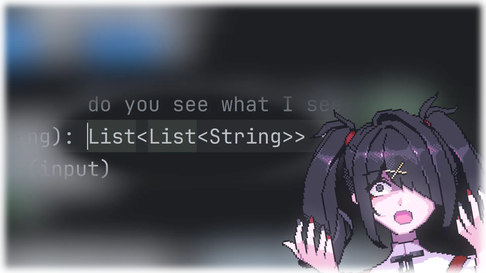

> [!WARNING]
> I haven't figured out how to set up compiler for release,
> so only way to run Kotlin projects is to open them in [JetBrains' IntelliJ Idea](https://www.jetbrains.com/idea/) (Ultimate) and run via that.
> 
> Sorry for an inconvenience if you were interested in some reason.

*a.k.a. newbie trying to do [Advent of Code 2023](https://adventofcode.com/2023/) (in Kotlin) for the first time :P*

## Screenshots

